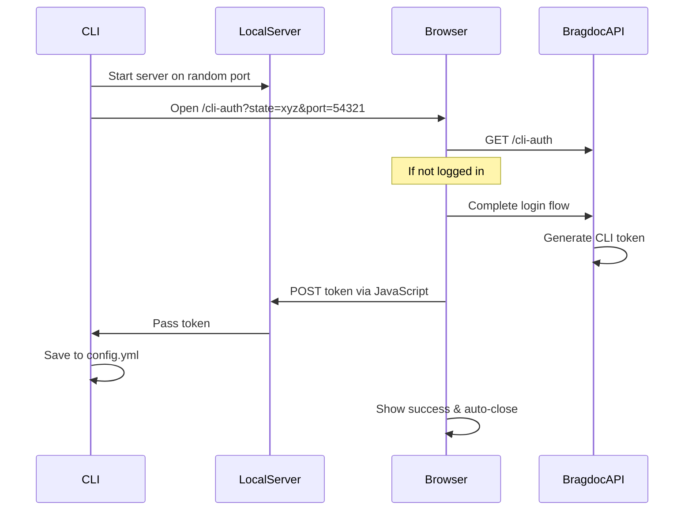

# CLI Authentication Implementation Plan

## Overview
Plan for implementing browser-based authentication flow for the bragdoc CLI tool, integrating with NextAuth.js backend.

## 1. User Experience Flow

### 1.1 CLI Side
```bash
$ bragdoc login
> Opening browser for authentication...
> Waiting for authentication to complete...
> Successfully authenticated! You can close the browser tab.
```

### 1.2 Browser Side
1. Browser opens to `https://bragdoc.ai/cli-auth?state={state}&port={port}`
2. User sees loading state with spinner
3. If not logged in:
   - Redirects to normal login page
   - After login, returns to cli-auth page
4. Once authenticated:
   - Shows success message with checkmark
   - "CLI Successfully Authenticated"
   - "You can close this window and return to your terminal"
   - Window auto-closes after 3 seconds

## 2. Technical Implementation

### 2.1 CLI Authentication Flow


### 2.2 CLI Auth Page Implementation
```typescript
// app/cli-auth/page.tsx
export default function CLIAuthPage() {
  const [status, setStatus] = useState<'pending' | 'success'>('pending');
  
  useEffect(() => {
    const authenticate = async () => {
      // 1. Get URL params
      const { state, port } = getURLParams();
      
      // 2. Generate CLI token
      const token = await generateCLIToken({
        deviceName: getDeviceName(),
        userId: session.user.id
      });
      
      // 3. Send to CLI's local server
      await fetch(`http://localhost:${port}`, {
        method: 'POST',
        body: JSON.stringify({ token, state })
      });
      
      // 4. Update UI
      setStatus('success');
      
      // 5. Auto-close window
      setTimeout(() => window.close(), 3000);
    };
    
    authenticate();
  }, []);
  
  return (
    <div className="flex min-h-screen items-center justify-center">
      {status === 'pending' && (
        <div className="text-center">
          <Spinner />
          <h1>Authenticating CLI...</h1>
        </div>
      )}
      
      {status === 'success' && (
        <div className="text-center">
          <CheckIcon className="text-green-500 w-16 h-16 mx-auto" />
          <h1 className="text-2xl font-bold mt-4">
            CLI Successfully Authenticated
          </h1>
          <p className="text-gray-600 mt-2">
            You can close this window and return to your terminal.
          </p>
        </div>
      )}
    </div>
  );
}
```

### 2.3 Token Management
```typescript
// lib/db/cli-tokens.ts
interface CLIToken {
  id: string;
  userId: string;
  token: string;
  deviceName: string;
  lastUsedAt: Date;
  expiresAt: Date;
}

async function generateCLIToken({
  userId,
  deviceName,
}: {
  userId: string;
  deviceName: string;
}): Promise<string> {
  const token = crypto.randomBytes(32).toString('hex');
  const expiresAt = new Date(Date.now() + 30 * 24 * 60 * 60 * 1000); // 30 days
  
  await db.insert(cliTokens).values({
    id: crypto.randomUUID(),
    userId,
    token,
    deviceName,
    expiresAt,
  });
  
  return token;
}
```

## 3. Implementation Steps

1. Frontend Changes:
   - Create `/cli-auth` page with loading and success states
   - Implement token generation and local server communication
   - Add device name detection
   - Style success/error messages

2. CLI Auth Command:
   - Implement local HTTP server
   - Add state parameter generation
   - Handle token storage in config
   - Add timeout handling (5 min max wait)

3. Database:
   - Add cli_tokens table
   - Add token management functions
   - Add token revocation endpoints

## 4. Security Considerations

- Local server only accepts localhost connections
- State parameter prevents CSRF
- Short server lifetime (closes after token received)
- Random port assignment prevents conflicts
- Device tracking for token management
- Secure token storage in config

## 5. Testing Plan

1. Unit Tests:
   - Token generation and validation
   - Config file management
   - Device name detection

2. Integration Tests:
   - Complete auth flow
   - Login requirement handling
   - Network error cases
   - Timeout scenarios

3. Security Tests:
   - CSRF protection
   - Local server security
   - Token storage security