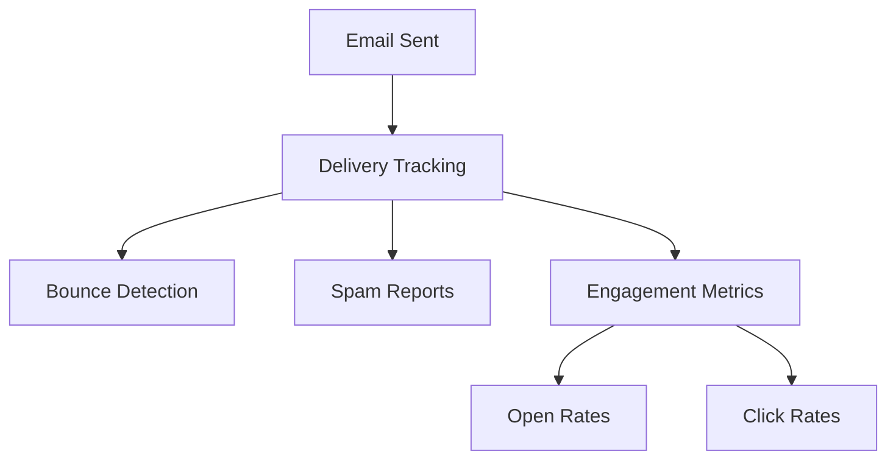

# Email System Requirements for bragdoc.ai

## Overview

Implementation of a comprehensive email system using Mailgun for both sending and receiving emails.

## Core Features

### 1. Welcome Email

- **Priority**: High
- **Requirements**:
  - Send automated welcome email when new user account is created
  - Include getting started guide and key features overview
  - Personalized with user's name and account details

### 2. Future Email Types (Planned)

#### Outbound Emails

| Email Type       | Purpose                                   |
| ---------------- | ----------------------------------------- |
| Weekly Summaries | Digest of user's weekly achievements      |
| Monthly Reviews  | Performance review compilations           |
| Re-engagement    | Bring inactive users back to platform     |
| Campaigns        | Product updates and feature announcements |
| Verifications    | Achievement verification requests         |

#### Inbound Email Processing

- Achievement submission via email (`hello@bragdoc.ai`)
- Email parsing for automatic achievement extraction
- Reply handling and confirmation messages

## Technical Requirements

### Mailgun Integration

- [x] Implement Mailgun SDK for Node.js
- [x] Configure domain verification and DNS settings
- [x] Set up sending email capabilities
- [ ] Set up receiving email capabilities
- [x] Implement email templating system for consistent styling

### Email Templates

- **Format Requirements**:
  - [x] Modular template system using React Email
  - [x] HTML and plain text format support
  - [x] Consistent branding across templates
  - [x] Preview functionality for development
  - [x] Proper unsubscribe mechanism implementation

### Security & Compliance

- **Authentication**:
  - [ ] SPF and DKIM authentication
  - [ ] GDPR compliance for EU users
- **Security Measures**:
  - [x] Secure credential storage using environment variables
  - [ ] Rate limiting implementation
  - [x] Input sanitization through Zod validation

### Monitoring & Analytics

- Track delivery rates
- Monitor bounce rates and spam reports
- Implement email engagement analytics
- Error logging and alerting system

## Implementation Guidelines

- TypeScript best practices
- Comprehensive error handling
- Environment variable configuration
- Test coverage requirements
- API documentation standards

## Dependencies

| Package    | Purpose                   |
| ---------- | ------------------------- |
| mailgun-js | Email service integration |
| TBD        | Email templating engine   |
| TBD        | Email validation          |
| Jest       | Testing framework         |

## Success Metrics

| Metric                  | Target |
| ----------------------- | ------ |
| Email Delivery Rate     | > 98%  |
| Welcome Email Open Rate | > 60%  |
| Spam Complaint Rate     | < 0.1% |
| Re-engagement Success   | > 15%  |

## Future Considerations

- [ ] Email processing scalability
- [ ] A/B testing implementation
- [ ] Additional email provider support
- [ ] Enhanced personalization features
