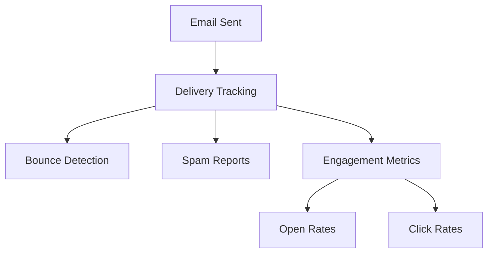

# Email System Requirements for bragdoc.ai

## Overview

Implementation of a comprehensive email system using Mailgun for both sending and receiving emails.

## Core Features

### 1. Welcome Email

- **Priority**: High
- **Status**: 
- **Requirements**:
  - Send automated welcome email when new user account is created
  - Include getting started guide and key features overview
  - Personalized with user's name and account details

### 2. Email Receiving

- **Priority**: High
- **Status**: 
- **Requirements**:
  - Receive emails at hello@bragdoc.ai
  - Process incoming emails for achievements
  - Use LLM to analyze and extract achievements
  - Store achievements in the database
  - Link achievements to correct user

### 3. Future Email Types (Planned)

#### Outbound Emails

| Email Type       | Status | Purpose                                   |
| ---------------- | ------ | ----------------------------------------- |
| Weekly Summaries | Planned | Digest of user's weekly achievements      |
| Monthly Reviews  | Planned | Performance review compilations           |
| Re-engagement    | Planned | Bring inactive users back to platform     |
| Campaigns        | Planned | Product updates and feature announcements |
| Verifications    | Planned | Achievement verification requests         |

#### Inbound Email Processing

- Achievement submission via email (`hello@bragdoc.ai`)
- Email parsing for automatic achievement extraction
- Reply handling and confirmation messages

## Technical Requirements

### Mailgun Integration

- [x] Implement Mailgun SDK for Node.js
- [x] Configure domain verification and DNS settings
- [x] Set up sending email capabilities
- [x] Set up receiving email capabilities
- [x] Implement email templating system for consistent styling
- [ ] Configure SPF and DKIM authentication

### Email Templates

- **Format Requirements**:
  - [x] Modular template system using React Email
  - [x] HTML and plain text format support
  - [x] Consistent branding across templates
  - [x] Preview functionality for development
  - [x] Proper unsubscribe mechanism implementation

### Security & Compliance

- **Authentication**:
  - [ ] SPF and DKIM authentication
  - [ ] GDPR compliance for EU users
- **Security Measures**:
  - [x] Secure credential storage using environment variables
  - [ ] Rate limiting implementation
  - [x] Input sanitization through Zod validation
  - [x] Webhook signature verification

### Monitoring & Analytics

- [ ] Track delivery rates
- [ ] Monitor bounce rates and spam reports
- [ ] Implement email engagement analytics
- [ ] Error logging and alerting system

## Implementation Guidelines

- [x] TypeScript best practices
- [x] Comprehensive error handling
- [x] Environment variable configuration
- [ ] Test coverage requirements
- [x] API documentation standards

## Dependencies

| Package      | Purpose                   | Status |
| ------------ | ------------------------- | ------ |
| mailgun-js   | Email service integration | Done |
| React Email  | Email templating engine   | Done |
| Zod          | Email validation          | Done |
| Vercel AI    | Achievement extraction    | Done |
| Jest         | Testing framework         | Planned |

## Success Metrics

| Metric                  | Target | Status |
| ----------------------- | ------ | ------ |
| Email Delivery Rate     | >98%   | TBD |
| Achievement Extraction  | >90%   | TBD |
| Response Time          | <500ms | TBD |
| User Satisfaction      | >4.5/5 | TBD |
